# 📁 Architecture du projet: AutoClaude

**Généré le**: 2026-04-25 08:58:15

**Chemin absolu**: `D:\ServOMorph\AutoClaude`

## 📊 Statistiques générales

- **Taille totale**: 395862.3 KB
- **Nombre de fichiers**: 116
- **Nombre de dossiers**: 22

## 🔑 Fichiers clés du projet

| Rôle | Chemin | Taille (KB) | Description |
|------|--------|-------------|-------------|
| Point d'entrée / serveur | `src\ui\app.py` | 8.0 | Application principale (Flask/FastAPI) [x-python] |
| Point d'entrée / serveur | `run.py` | 0.1 | Script de lancement [x-python] |
| Configuration | `src\config\settings.py` | 1.2 | Script Python (1.2KB) [x-python] |
| Configuration | `src\config\constants.py` | 1.0 | Script Python (1.0KB) [x-python] |
| Configuration | `src\config\__init__.py` | 0.0 | Script Python (0.0KB) [x-python] |
| Tests | `.github\workflows\tests.yml` | 1.2 | Configuration YAML (1.2KB) |
| Tests | `tests\unit\test_protection_button.py` | 0.3 | Script Python (0.3KB) [x-python] |
| Tests | `tests\unit\test_activate_button.py` | 0.3 | Script Python (0.3KB) [x-python] |
| Tests | `tests\unit\test_claude_md_protector.py` | 0.3 | Script Python (0.3KB) [x-python] |
| Tests | `tests\unit\test_warning_banner.py` | 0.3 | Script Python (0.3KB) [x-python] |
| Tests | `tests\unit\test_analytics_window.py` | 0.3 | Script Python (0.3KB) [x-python] |
| Tests | `tests\unit\test_click_counter.py` | 0.3 | Script Python (0.3KB) [x-python] |
| Tests | `tests\unit\test_folder_picker.py` | 0.3 | Script Python (0.3KB) [x-python] |
| Tests | `tests\unit\test_autoclick_service.py` | 0.3 | Script Python (0.3KB) [x-python] |
| Tests | `tests\unit\test_footer.py` | 0.3 | Script Python (0.3KB) [x-python] |
| Tests | `tests\unit\test_header.py` | 0.3 | Script Python (0.3KB) [x-python] |
| Tests | `tests\unit\test_click_stats.py` | 0.3 | Script Python (0.3KB) [x-python] |
| Tests | `tests\unit\test_constants.py` | 0.3 | Script Python (0.3KB) [x-python] |
| Tests | `tests\unit\test_settings.py` | 0.3 | Script Python (0.3KB) [x-python] |
| Tests | `tests\unit\test_detector.py` | 0.3 | Script Python (0.3KB) [x-python] |

## 🌳 Arborescence (aperçu Mermaid)

```mermaid
graph TD
  root["📁 AutoClaude/"]
  root_0_0["📁 .github/"]
  root --> root_0_0
  root_1_0["📄 .gitignore"]
  root --> root_1_0
  root_2_0["📁 assets/"]
  root --> root_2_0
  root_3_0["📄 audit_after.json"]
  root --> root_3_0
  root_4_0["📄 audit_before.json"]
  root --> root_4_0
  root_5_0["📄 AutoClaude.spec"]
  root --> root_5_0
  root_6_0["📄 AutoClaude_v2.2.1.spec"]
  root --> root_6_0
  root_7_0["📄 AutoClaude_v2.3.0.spec"]
  root --> root_7_0
  root_8_0["📁 build/"]
  root --> root_8_0
  root_9_0["📄 build.py"]
  root --> root_9_0
  root_10_0["📄 CHANGELOG.md"]
  root --> root_10_0
  root_11_0["📄 CODE_OF_CONDUCT.md"]
  root --> root_11_0
  root_12_0["📄 CONTRIBUTING.md"]
  root --> root_12_0
  root_13_0["📁 dist/"]
  root --> root_13_0
  root_14_0["📁 DOCS/"]
  root --> root_14_0
  root_15_0["📄 LICENSE"]
  root --> root_15_0
  root_16_0["📄 pyproject.toml"]
  root --> root_16_0
  root_17_0["📄 README.md"]
  root --> root_17_0
  root_18_0["📄 requirements-dev.txt"]
  root --> root_18_0
  root_19_0["📄 requirements.txt"]
  root --> root_19_0
  root_20_0["📄 run.py"]
  root --> root_20_0
  root_21_0["📁 src/"]
  root --> root_21_0
  root_22_0["📁 tests/"]
  root --> root_22_0
  root_23_0["📄 type_hints_todo.json"]
  root --> root_23_0
```



## 📋 Structure détaillée

📁 **.github/**
   _.github_

📁 **assets/**
   _assets_

📁 **build/**
   _build_

📁 **dist/**
   _dist_

📁 **DOCS/**
   _DOCS_

📁 **src/**
   _src_

📁 **tests/**
   _tests_

📄 `.gitignore` - Git - Fichier d'ignorance [plain]
   _.gitignore_
📄 `audit_after.json` - Configuration/Données JSON (1.8KB) [json]
   _audit_after.json_
📄 `audit_before.json` - Configuration/Données JSON (2.1KB) [json]
   _audit_before.json_
📄 `AutoClaude.spec` - Fichier .spec (1.3KB)
   _AutoClaude.spec_
📄 `AutoClaude_v2.2.1.spec` - Fichier .spec (0.8KB)
   _AutoClaude_v2.2.1.spec_
📄 `AutoClaude_v2.3.0.spec` - Fichier .spec (0.8KB)
   _AutoClaude_v2.3.0.spec_
📄 `build.py` - Script Python (1.0KB) [x-python]
   _build.py_
📄 `CHANGELOG.md` - Documentation Markdown (0.6KB)
   _CHANGELOG.md_
📄 `CODE_OF_CONDUCT.md` - Documentation Markdown (2.4KB)
   _CODE_OF_CONDUCT.md_
📄 `CONTRIBUTING.md` - Documentation Markdown (2.0KB)
   _CONTRIBUTING.md_
📄 `LICENSE` - Fichier sans extension (1.1KB)
   _LICENSE_
📄 `pyproject.toml` - Fichier .toml (1.6KB)
   _pyproject.toml_
📄 `README.md` - Documentation principale du projet
   _README.md_
📄 `requirements-dev.txt` - Fichier texte (0.1KB) [plain]
   _requirements-dev.txt_
📄 `requirements.txt` - Python - Dépendances du projet [plain]
   _requirements.txt_
📄 `run.py` - Script de lancement [x-python]
   _run.py_
📄 `type_hints_todo.json` - Configuration/Données JSON (14.1KB) [json]
   _type_hints_todo.json_

## 📂 Fichiers à fournir en priorité aux IA

Liste courte de chemins à partager en premier au modèle pour qu'il comprenne le projet :

```text
README.md
src\ui\app.py
run.py
src\config\settings.py
```

## 🤖 Instructions pour les IA

- Utilisez les chemins relatifs indiqués pour demander des fichiers.
- Exemple: `Peux-tu m'afficher le contenu de src/main.py ?`.
- Référez-vous à la section **Fichiers clés du projet** pour prioriser l'analyse.
- Utilisez la section **Fichiers à fournir en priorité aux IA** pour sélectionner les 4 premiers fichiers à partager (incluant toujours README.md).
