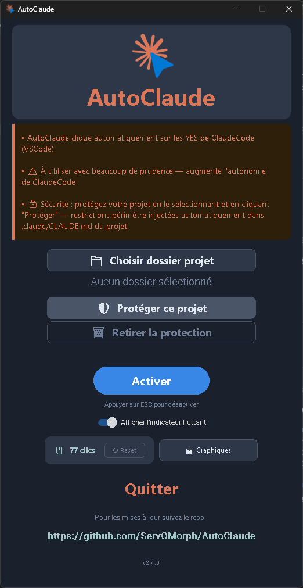

# AutoClaude

[](https://opensource.org/licenses/MIT)
[](https://www.python.org/)
[](https://github.com/ServOMorph/AutoClaude/actions/workflows/tests.yml)
[](https://github.com/ServOMorph/AutoClaude/releases)

> **Conçu pour [Claude Code](https://claude.ai/code) dans VS Code** — donne plus d'autonomie à Claude Code en cliquant automatiquement sur les boutons de confirmation récurrents, sans interrompre le flux de travail de l'IA.

Outil Python qui détecte et clique automatiquement sur un bouton récurrent à l'écran — avec une interface graphique CustomTkinter en mode sombre.

Quand Claude Code travaille dans VS Code, il demande régulièrement une confirmation utilisateur (bouton "Continuer", "Approuver", etc.). AutoClaude surveille l'écran en arrière-plan et clique à ta place, permettant à Claude Code de tourner en continu sans surveillance constante.

> Développé par [SéréniaTech](https://serenia-tech.fr) · [GitHub](https://github.com/ServOMorph)

---

## Fonctionnalités

- Détection d'image par template matching (OpenCV + mss)
- Support multi-moniteur
- Dégradation progressive : si une dépendance optionnelle manque, l'outil continue de fonctionner
- Arrêt via Esc, fermeture fenêtre ou mouvement souris (mode auto-stop)
- Protection de projet Claude Code via injection dans `.claude/CLAUDE.md`
- **Compteur de clics** avec historique persisté
- **Analyses graphiques** : navigation temporelle (Récent / Tout), bandeau de statistiques (total, moyenne, record, jours actifs), graphes par heure/jour/semaine/mois/année
- Logs rotatifs (`~/.autoclaude/logs/`) et watchdog de stabilité pour une utilisation longue durée
- Interface sombre SéréniaTech (CustomTkinter)
- Paramètres persistés localement (`~/.autoclaude/settings.json`)

---

## Installation

### Option 1 : Télécharger l'exécutable (Windows)

Télécharge `AutoClaude_v2.3.0.exe` depuis les [releases](https://github.com/ServOMorph/AutoClaude/releases) et double-clique pour lancer. Aucune dépendance Python requise.

### Option 2 : Installation depuis le code source

```bash
# Cloner le dépôt
git clone https://github.com/ServOMorph/AutoClaude.git
cd AutoClaude

# Installer les dépendances
pip install -r requirements.txt

# Lancer l'application
python run.py
```

### Dépendances (installation depuis source)

**Obligatoires**

| Package | Rôle |
|---------|------|
| `pyautogui` | Détection et clic d'image (fallback) |
| `pynput` | Écoute clavier/souris |
| `customtkinter` | Interface graphique |
| `Pillow` | Affichage des images |
| `matplotlib` | Graphes d'analyse |
| `psutil` | Monitoring mémoire/stabilité |

**Optionnelles** (meilleures performances)

| Package | Rôle |
|---------|------|
| `opencv-python` | Template matching haute précision |
| `mss` | Capture multi-moniteur rapide |
| `numpy` | Traitement d'image (requis par OpenCV) |
| `screeninfo` | Énumération des moniteurs |

---

## Interface



---

## Utilisation

```bash
# Lancer l'interface graphique
python run.py
```

L'interface permet de :
1. **Activer / désactiver** l'autoclick via le bouton bleu/rouge
2. **Sélectionner un dossier de projet** à protéger
3. **Appliquer ou retirer** la protection Claude Code sur ce dossier
4. **Compter les clics** — affichage en temps réel du nombre total, avec reset possible
5. **Visualiser les analyses** — navigation par période, mode Récent/Tout, stats chiffrées


### Analyses

La fenêtre d'analyses offre :
- **5 périodes** : Heure, Jour, Semaine, Mois, Année
- **Mode Récent** (défaut) : fenêtre glissante — 24h / 30 jours / 12 semaines / 12 mois
- **Mode Tout** : historique complet avec navigation Précédent / Suivant (paginé par jour, mois ou année)
- **Bandeau de stats** : total, moyenne par jour actif, record journalier, jours actifs

### Arrêt

- Touche **Esc** — arrête l'autoclick
- **Fermeture de la fenêtre** — arrête proprement le thread
- **Mouvement souris** — si le mode auto-stop est actif

---

## Image cible

Par défaut, AutoClaude cherche `assets/yes.png`. Remplace ce fichier par un screenshot du bouton que tu veux automatiser (PNG, JPG ou BMP recommandé).

---

## Protection Claude Code

Le bouton **Protéger** injecte un bloc de restrictions dans `.claude/CLAUDE.md` du projet sélectionné. Ce bloc est lu par Claude Code au démarrage de chaque session et contraint le comportement de l'IA au périmètre du projet.

Voir [DOCS/SECURITY.md](DOCS/SECURITY.md) pour le détail du bloc injecté et de l'API.

---

## Logs & stabilité

AutoClaude est conçu pour tourner en continu. Les logs sont disponibles dans `~/.autoclaude/logs/autoclaude.log` (rotation automatique, 5 Mo × 3 fichiers). En cas de crash ou de comportement anormal, ce fichier est le premier endroit à consulter.

---

## Architecture

```
src/core/       détection, clic, listener, service autoclick, logger, health monitor
src/ui/         interface CustomTkinter + composants + dialogs + overlays
src/security/   ClaudeMdProtector
src/config/     constantes et persistance JSON
assets/         yes.png, logo.png
```

Voir [DOCS/ARCHITECTURE.md](DOCS/ARCHITECTURE.md) pour le détail des décisions techniques.

---

## Mises à jour

Pour rester informé des dernières versions et améliorations d'AutoClaude, n'hésitez pas à suivre le dépôt GitHub officiel :
[https://github.com/ServOMorph/AutoClaude](https://github.com/ServOMorph/AutoClaude)

Vous y trouverez les notes de version, les nouvelles fonctionnalités et les correctifs de bugs.

---

## Licence

MIT — voir [LICENSE](LICENSE)

---

Projet réalisé par ServOMorph avec ClaudeCode pour SérénIA Tech :
https://serenia-tech.fr/

Date : 25 avril 2026 (v2.3.0)

---

## Contribuer

Les contributions sont les bienvenues ! Consulter [CONTRIBUTING.md](CONTRIBUTING.md) pour démarrer.
